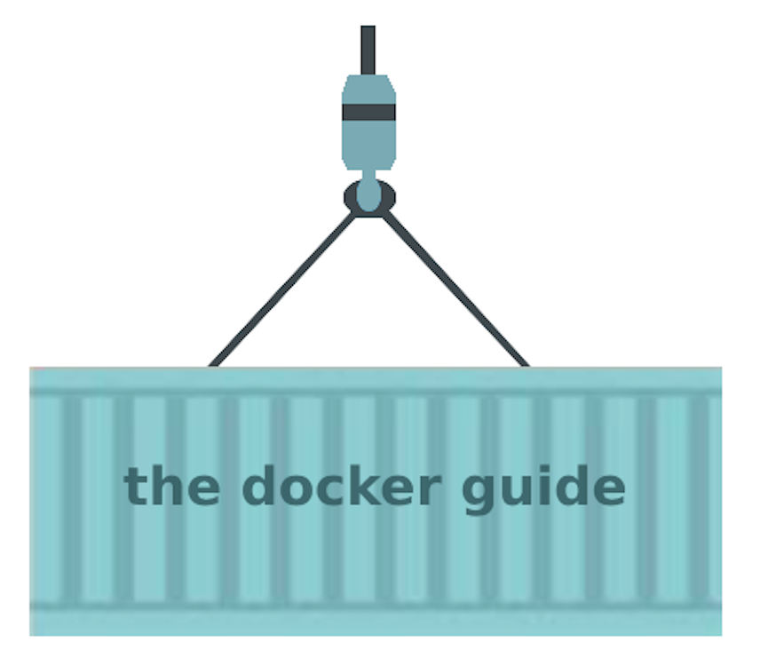

# the docker guide



## Scope of this guide 

With this little guide I am trying to teach you the basics of Docker, which are required to get started. From my experience, beginners tend to build Dockerfiles which are not optimised for storage and fast build time. That is why I have focused on this topic, by explaining best-practices for Dockerfiles, image layers, choosing parent images, chaining commands and much more.

## Chapters
- [Why you should learn Docker](#why-you-should-learn-docker)
- [Virtualization](#virtualization)
- [What are Docker containers?](#what-are-docker-containers)
- [Docker architecture](#docker-architecture)
- [Dockerfile → Image → Container](#dockerfile-→-image-→-container)
- [Increasing performance](#increasing-performance)
- [How to install Docker on your machine](#how-to-install-docker-on-your-machine)
- [Docker cli commands](#docker-cli-commands)
- [Run your first container](#run-your-first-container)
- [Building a Dockerfile](#building-a-dockerfile)
- [Outlook: Docker Compose](#outlook-docker-compose)


## Why you should learn Docker

As a professional in the field of IT, whether you're working in DevOps, Software Engineering or Data Engineering, having knowledge of containerization is crucial. According to the jobscraping website datanerd.tech, Docker is mentioned in 16% of all job postings for Software Engineers. However, even if it is not explicitly mentioned in the job description, at some point in your career, you will find the need to containerize something.


In one sentence, containerization gives you the ability to package an application and run it consistently in any environment, be it on a colleague's PC, in an orchestrated cluster, or on a serverless function. Docker, as a containerization engine, makes deployment easy and convenient. While there are other engines available for containerization, Docker has become the de facto standard and can be easily integrated with almost any deployment.

So let's take a step back and understand some concepts.

## Virtualization 

In a broader sense, virtualization refers to the creation of a virtual version of something. In the field of IT, virtualization allows you to create multiple instances of a machine within a machine, with each instance having its own operating system to run various applications. A hypervisor is responsible for creating and managing these virtual machines, allocating resources to them and separating multiple VMs on the same host. Virtual machines offer a high degree of isolation from the host and are great for utilizing your servers to the fullest if they would otherwise not be fully utilized. Cloud servers like AWS EC2, for example, use virtual machines with virtual disks.

However, scaling up a virtual machine requires the installation of an OS in each instance, which drains a lot of computational resources from the host. Virtual machines also take a significant amount of time to start up and are a lot of overhead for many small services. Furthermore, just because an application works on your laptop, it does not necessarily mean it will work when running it on a VM in production.

This is where containers come in hand. They are a lightweight way to package an application, are portable, and can be deployed almost anywhere (as long as Docker is installed on the host). Containers are also simple and fast to start up. When you package your application in a container, you have consistent behavior across machines, and it is isolated from the host (although not as much as with a VM). Additionally, containers generally require fewer resources compared to a virtual machine.

## What are Docker containers?

An operating system has a kernel, which is used to communicate with the underlying hardware. A Docker container virtualizes the applications layer of an operating system, applications / dependencies and other required files, but uses the hosts kernel. In contrast to that, a virtual machine has its own kernel. This is also the reason why Docker starts up way faster and is more lightweight. 

Docker containers are mostly Linux based and use the hosts kernel, does that mean I can run Linux containers only on a Linux Os? 

__No__, if you are using Mac OS or Windows you can download Docker Desktop, which runs a Linux Kit VM  on which the containers will run. 

**In one sentence:** A container packages an application, service or function with all of it's libraries, configuration files, dependencies and other necessary parts and parameters to operate. A container does not have its own kernel but uses the one of the hosts operating system.

## Docker architecture 

This is a very simple description of the underlying architecture of Docker, which should be sufficient for the scope of this guide. 

Docker's underlying architecture is based on a client-server model, where the client communicates with the Docker daemon via a REST API, network interface, or UNIX sockets. The Docker daemon manages images and containers, while the client is used to interact with the daemon by sending API requests such as 'docker run'.


## Dockerfile → Image → Container

Before we start with installing Docker, there are 3 important concepts that need to be clarified. 

A __Dockerfile__ serves as a blueprint written by the user to outline the necessary steps for building an image, which are then executed by the Docker daemon. When talking about images and best practices I will introduce layers. For now it is only important to know that since Docker 1.10, only RUN, COPY, and ADD instructions create new layers.

A **Docker Image** is an immutable template for a Docker container. 

Such an Image consists of multiple **layers**, all of them are in the end combined to a virtual file system with a bunch of files for all dependencies, custom added files, application code and so on, that have been added based on these commands. The layers depend on the intermediary ones below. This is very important, because if you change one layer, you have to change all layers above it too. Thus for reduced build time, you should generally place the largest layer at the top of your Dockerfile, but more on this in the next chapter.  Layers come in hand when building your Image, since they can be cached and do not necesery all need to be rebuilt when you change something.

As you can see: understanding layers is extremely important for minimizing build time, size and network transfer time of docker images. Thats why our next chapter will deal with how to optimize performance through layers.

Last but not least the **Container**. 

The Docker daemon takes the image, adds a read-write layer (the container layer) on top, in which changes to the running container are stored, and it initializes various settings including network ports, container name, ID and resource limits and the result is finally a container.

## Increasing performance

When talking about increasing  performance and Docker. One generally refers to the following two concepts:

- Build time of image / updates to it
- Space used

These are topics that are not trivial and thus often being neglected by beginners, who just want to containerize something. However they are important and can save a lot of nerves and cost over the long run. 

In this guide I will teach you the basics of optimizing your images with a few tricks. One important prerequisite is that you have understand the concept of layers in Dockerfiles. In the following, I will name **7 ways of optimizing build time and size**. 

One concept is to keep common layers that rarely change at the top of your Dockerfile or in a parent image. This allows the layer to be cached and reused in later builds. If you would have them below statements that change more often in your Dockerfile the common ones would need to rerun too. (Remember layers depend on the ones below it). By keeping them as a lower layer and thus caching them when layers above it change, build time is decreased. 

One thing, I see often is downloading a file in one statement and changing permissions in another one. This results in the file being copied to the current layer, doubling the disk space and network bandwidth used for that file.

In general you should understand that if you have a file in one layer and you do something with it in another statement, you will now have the original file and it’s changed version in two different layers. 

You can reduce layers by chaining Run commands together (especially when downloading dependencies). This leads to a reduced number of image layers. However chaining commands has the side effect that if a large chained statement fails, nothing of it can be cached. Thus if you have a RUN statement that might break often, it is a good idea to keep it in an extra statement. 

Moreower for most images there exist slimmed down versions. For Python this is the python:version-slim Image. For Linux you do not necesseraly need a bloated Ubuntu image, when you also have a slimmed down Alpine Linux imagine. 

When you are building multiple images that have a lot in common, you can build a parent image with the layers that are needed in each of the other images. This enables us to apply changes that apply to all of them in one place and the common layers from that image can be loaded from cache, which saves build time.

## How to install Docker on your machine

### Linux 
(Ubuntu example)
```bash
sudo apt-get install docker-ce docker-ce-cli containerd.io docker-buildx-plugin docker-compose-plugin
```
### Mac OS

```bash
brew install docker
```

And install Docker Desktop from the official website

## Docker cli commands

I will present you the most important commands which are probably 90% of the ones you will use. These commands all have flags / options. I will not go into detail on all options / flags here, just on the most important ones. If you look into the official Docker documentation for each command, you will find all of them.

**The build command**

Builds a Docker image out of a Dockerfile. if you leave the name blank, the image will get a random name. You can build it from a path on your machine or specify a url to the Dockerfile, f.e in a Github repo.

```bash
docker build -t <image_name> <Path/url> 
```
Lets use the example of a Dockerfile for a MySQL database, which is in the same folder as you currently "are":

```bash
docker build -t "mysql" .
```

If you want to not cache anything from a previous version of the image, you can use the __—no-cache__ flag before the path. 

__The docker run command__

This command is used to start a new container based on an image:

```bash
docker run --name <container_name> <image_name>
```
Docker run has quite a few useful parameters. I will show you the most important ones:

|option   | explanation  |
|---|---|
| -d  | runs container in the background and thus will not display any output in your shell window  |
| —rm  | removes the container after it stops  |
| -e <variable=value> | Sets the value to an env variable, which is referenced in the container   |
| -v host_path:container_path  | attatches a local filepath to it, in which data from a specific path from the container is persisted. If the folder on the host is not empty, the files will be imported into the docker container   |
| —publish <port> | This allows to map a port inside the container to a port on the host machine. In the MySQL example you could access the mysql db on the host machines port 8080 when using the option |

```bash
docker run —name mysql —publish 8080  mysql_image
```

__Stoping a container__

Stops the Container, without loosing the data.
```bash
docker stop <container>
```

__Start a container__

Starts an already existing container, that has been stopped.

```bash
docker start <container>
```

__List all images__

Lists all existing imagines on the Host

```bash
docker images
```

__List all containers__

Lists all containers on the host
```bash
docker container ls 
```

__List all running containers__

```bash
docker ps
```

__Remove containers__

Removes 1 or multiple Containers

```bash
docker rm <container> <container>
```
The following flags are especially relevant for the rm command:

| option  | explanation  |
|---|---|
| —-force  | Stop a container, even if running  |
| —-volume   | Removes all associated volumes too   |
| -v <volume_name>   | Removes only the specified volume   |

__Remove all stopped containers__

```bash
docker container prune
```

__Remove images__

You can delete one or multiple images which are not tagged in repositories or used by containers, via:
```bash
docker rmi <image> <image>
```
With the __-f__ flag, the image will be deleted, even if currently in use.

__Running commands in the container__

Runs a new command in the container, in it’s default directory if you have not set a custom WORKDIR. In the following example, I would use the terminal in the container and "view" it in my terminal:

```bash
docker exec -it <container> bash
```
The following options are important:

| option  | explanation  |
|---|---|
| -d  | Runs the command in the background (no output is shown)   |
| -e   | Set environment variable    |
| -w  | Specify the directory in which the command should be run   |
| -i  | Container's standard input (stdin), standard output (stdout), and standard error (stderr) streams will be connected to your terminal.  |
| -t  | Run a pseudo terminal, which in contrast to the -i flag, not only redirects the stdin, stdout and stderr to your terminal but spawn a terminal in the container to interact with it.  |
| -it  | Open an interactive shell inside a running container and execute commands just as if you were logged in to the container's console.   |

__List all networks__

```bash
docker network ls
```

__Pull an image from a repository__

So far I have not talked about repositories for Docker. These are just a central place where you can store docker images and make them easily accessible for others within a certain group or even publicly. The most common ones are AWS ECR and Dockerhub. If not specified, docker will always try to pull from Dockerhub. For your own projects you will pull many images, either as a parent image or as a standalone service that someone has already built, like a MySQL database.

```bash
docker image pull <image:version_tag>
```
The version tag specifies the version of the image. It is bad practice to leave it blank or set it to latest. Instead you should always use a distinct tag. This is because functionalities might change for different versions, which could lead to your project not working if a newer one is pulled. By default always the latest will be pulled. On Dockerhub you will find a list with the version tags if you klick on tags. 

## Run your first container

I have built a little example for you, so that you can test the beforehand explained commands and run your first container.

Your to do's are:

- navigate in the /example_container folder
- build the Image 
- run the container and map the relevant port
- open your browser and go to: https://localhost:5000
- stop the container 
- remove the container 
- remove the image

## Building a Dockerfile

A Dockerfile is either based on a base image or a parent image. There are cases in which using multiple parent images is useful. These are called multistage builds, but are neglected in this guide. 

But what exactly is the difference between parent and base images?

When using a parent image, you reference a preexisting image that would also be usable on it’s own with a FROM clause at the top of your Dockerfile. F.e if you want to base your image on python:3.10-slim, you would write as the firsdt line in your Dockerfile:
```bash
FROM python:3.10-slim 
```
The first layer is going to be the python:3.10-slim image. The referenced image can be one that you have already built or someone elses, which will then be pulled from Dockerhub. 

This would however mean that each image has to be built on a preexisting one, creating a never ending chain. As a logical consequence, the need for base images arises at some point or another. 

As you can probably guess by now, a base image is a completely new image.
You can build base images using tar or basing them on the scratch image. 

When using __tar__, in most cases, you need to run the distribution you want to package on your machine. The required system libraries, configuration files, and other files that will be needed by containers that are based on this image have to be moved in a folder. The tar archive of this folder then needs to be imported as a docker image to docker: 

```bash
docker import <foldername>.tar mybaseimage:latest
```

__Scratch__ on the other hand is an empty image which is not counted as a layer in your image, instead it signals that the next line is going to be the first layer.The scratch image includes no files, dependencies and libraries. You thus have to install all of them your self or add the script you want to execute as a statically compiled binary. 

Building your own base images is likely not relevant as a beginner, however I still believe it is important to know about in a brief manner.


A Dockerfile always uses a set of standard commands to create the image. As a little reminder: 

Only RUN, ADD and COPY create a new layer within the image. In the following lines I will explain the most important ones and at the end you will be able to create your own Dockerfile. 

__LABEL__

A label adds metadata to an image via key-value pairs:

```bash
LABEL <key>=<value> <key>=<value> <key>=<value> ...
```
You could f.e set the maintainer of the image through:
```bash
LABEL maintainer = “John Doe”
```

__WORKDIR__

The workdir sets the directory for the subsequent RUN, ADD, CMD, ENTRYPOINT and COPY commands. If you specify multiple workdirs they will be set relative to the one before. If a workdir is not set, commands will be run in the root directory.

__ADD__ 

ADD is used to add files from a source directory to a directory in the container. ADD extracts the file and copies it into the destination. In the case of a locally compressed file, add will automatically extract it. Compared to the COPY command, one additional advantage is that you can also copy files from an URL pointing to it. 

```bash
ADD ./scripts/helloworld.py .
```

This command would add the helloworld.py file to either the home directory of the container or the custom WORKDIR if it has been specified beforehand. 

__COPY__

Copy duplicates files and is not able to uncompress files or extract them from Url’s. 

```bash
COPY ./scripts/helloworld.py .
```

It is seen as best practice to use the COPY command instead of ADD, since it behaves more predictable, due to just having one purpose. Using ADD is only advised when you want to either unpack something directly or Add a file from an Url.

__RUN__

Enables to run Unix commands to do something with your Dockerfile, f.e do a request to some Api or changing rights on files using chmod. Each RUN statement creates a new layer, thus it is sometimes advisable to chain multiple unix commands together. 

```bash
RUN curl ...
```

__EXPOSE__

The EXPOSE command exposes a port in your container. You have already learnt that you can use the -p <container_port:host_port> option with docker run to map ports. This would also work when the container_port is not exposed in the Dockerfile. I view EXPOSE as a mean of documentation, such that when others are using your Dockerfile, they know which ports need to be used. 

```bash
EXPOSE 8080
``` 

__ENV__

Used for setting environment variables, that do not need to be set dynamically when starting a container with the -e option. 

```bash
ENV MY_NAME="John Doe"
```

__CMD & ENTRYPOINT__

So far I have only specified things that should be done with a Dockerfile via the RUN, ADD and COPY command. Let’s assume you have a script which should be executed upon startup. To make this possible there has to be a way to specify a default action that should be run upon container startup. 

This can be done via CMD or ENTRYPOINT. The most important difference between the two is that CMD commands can be overwritten when you specify a command within docker run. ENTRYPOINT ones can not be overwritten. 

Both follow the general form: CMD/ENTRYPOINT [command, parameter, parameter, ...]

```bash
CMD ["echo", "Hello World"]
```

```bash
ENTRYPOINT ["echo", "Hello World"]
```

To see all of these ones in action, I have added a Dockerfile, which I have created for a CLI for Trino, a distributed query engine:

```bash 
FROM alpine:3.16

RUN apk update && \
    apk add --no-cache openjdk8-jre-base && \
    apk add --no-cache curl && \
    apk add --no-cache bash && \
    apk add --no-cache ca-certificates && \
    update-ca-certificates && \
    rm -rf /var/cache/apk/*

WORKDIR /app


RUN curl -o trino-cli-411-executable.jar https://repo1.maven.org/maven2/io/trino/trino-cli/411/trino-cli-411-executable.jar && \
    mv trino-cli-411-executable.jar trino && \
    chmod +x trino

ENV JAVA_HOME /usr/lib/jvm/java-1.8-openjdk
ENV PATH $JAVA_HOME/bin:$PATH
ENV PATH=$PATH:/app/

CMD [ "sh", "-c", "\
    if test -v CONNECTION_USER && test -v CONNECTION_PW; then \
        ./trino --server \"$CONNECTION_URI\" --user \"$CONNECTION_USER\" --password \"$CONNECTION_PW\" && sleep infinity; \
    elif test -v CONNECTION_USER; then \
        ./trino --server \"$CONNECTION_URI\" --user \"$CONNECTION_USER\" && sleep infinity; \
    elif test -v CONNECTION_PW; then \
        ./trino --server \"$CONNECTION_URI\" --password \"$CONNECTION_PW\" && sleep infinity; \
    else \
        ./trino --server \"$CONNECTION_URI\" && sleep infinity; \
    fi" ]
```

I use alpine linux as a parent image, since it is very leightweight. Remember, to always use a version tag.
Afterwards I am installing some dependencies via the RUN command. 
In the 3rd step the Workdir for all of the subsequent commands is set to /app, where the cli executable will be. Next the cli jar is downloaded, furthermore the access rights are changed within the same layer to not create unnecessary layers. In the penultimate step, environment variables that are required to execute the cli are set. The CMD execution is a bit complex here, since I made it dependent on variables set with -e when starting the container. Their value can be reference anywhere in the Dockerfile by a simple $variable_name. 

## Outlook: Docker Compose

Imagine you are building a project that involves various containers for multiple services. You might want to share networks, create storage and start them up simoustanly. This is what docker compose is used for. Compose enables you to define the follwoing things in one file: 
- Storage for containers 
- Network for containers 
- Containers and their configs 
- Which containers depend on which ones 
- What to do when a container stops 
- Share variables 

You use a YAML template to define your services and their configurations. 
Under the hood the docker daemon just parses the docker-compose.yml file and creates the containers with their configs etc. 
Compose will not be scope of this guide, but is it useful to know it's purpose, even as a beginner.

